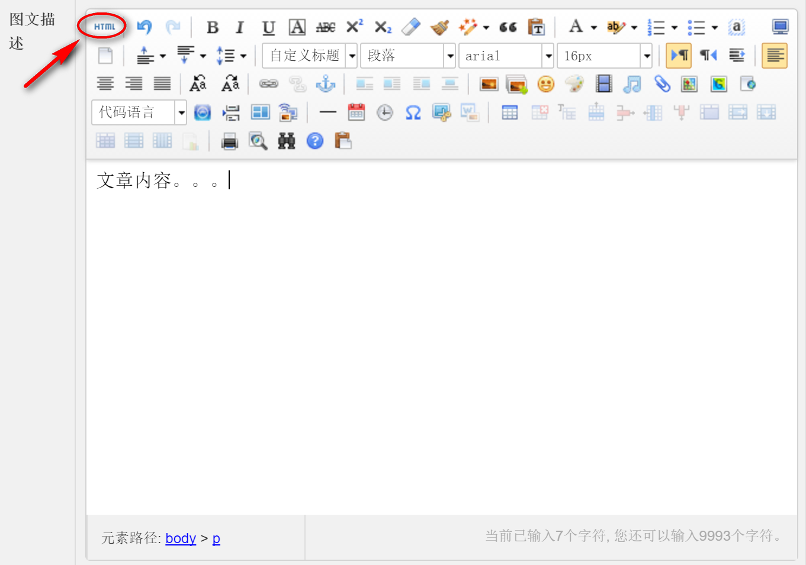
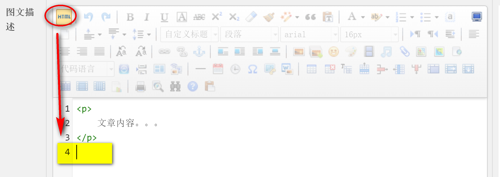
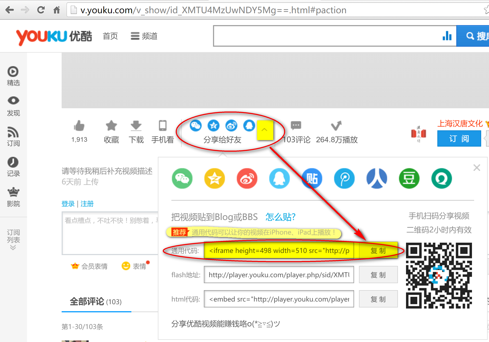
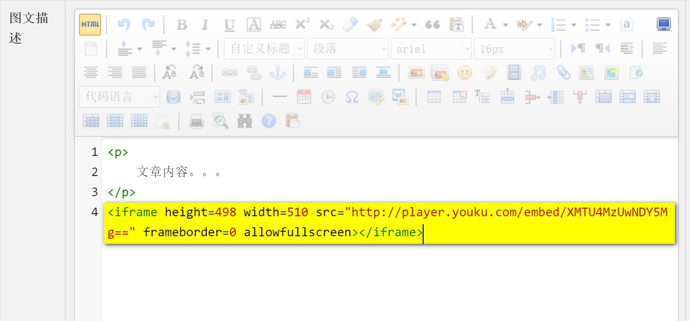
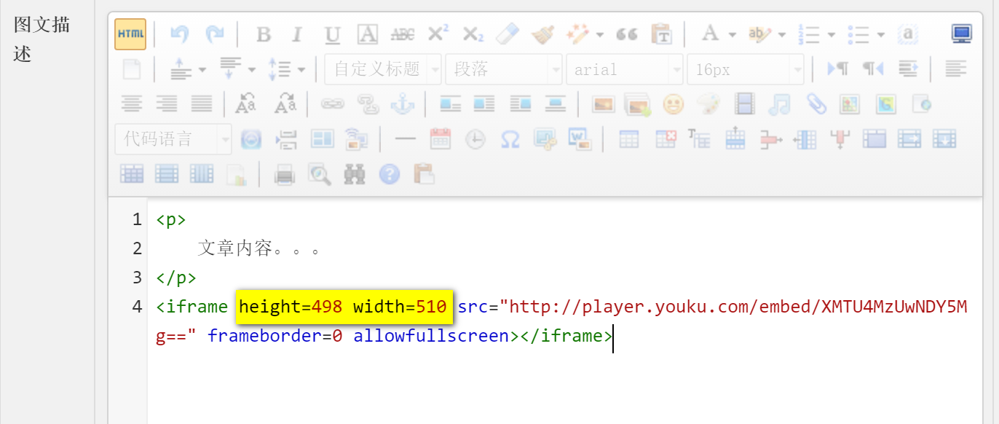
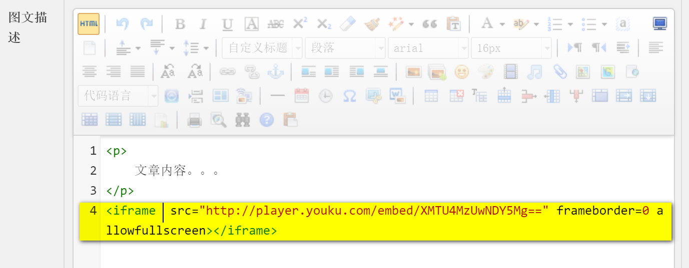
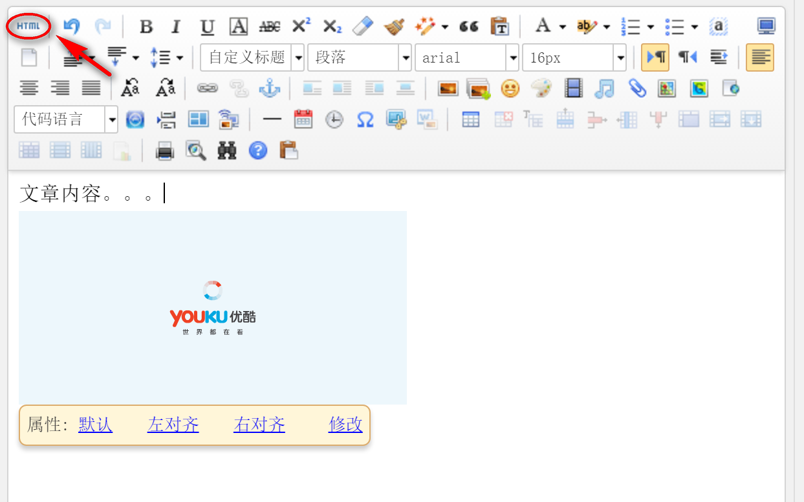

# 百度编辑器中添加视频

1. 编辑同款、资讯的时候如果需要添加视频，点击编辑器左上角的`HTML`图标切换到`源码`模式
   

2. 切换到源码视图后，将光标移动到当前编辑区域的最后面
   

3. 进入视频网站*[^（以优酷为例）]*，点开视频下方的`分享给好友`，点击`通用代码`后面的`复制`[^Ctrl+C]按钮
   

4. 返回后台的百度编辑器，将复制的通用代码粘贴[^Ctrl+V]到编辑区域最后面的光标所在区域
   

5. 将代码中的`height`、`width`删除
   
   

6. 再次点击编辑器左上角的`HTML`图标切换回预览模式，即可看到效果
   