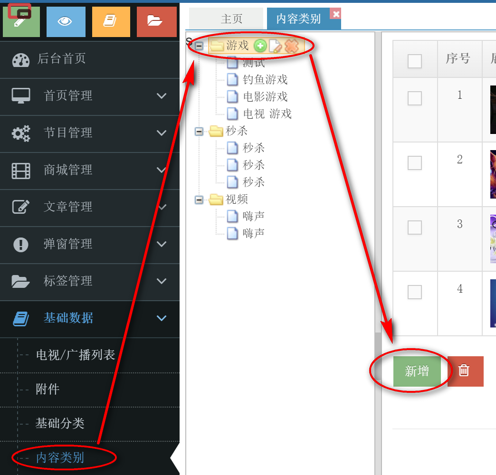

# 首页及各分类页面的`游戏入口`维护

1. 登录后台，进入`基础数据` >`内容类别` 
   
2. 进入`游戏类别`，点击`新增`或`编辑`已有游戏
   
   
3. 打开新增弹出层，填写游戏入口相关信息
   - 选择入口所在的`相关频道`
   - 填写游戏`标题`
   - 上传入口显示的`活动宣传图`
   - 填写游戏的`地址`
   - 填写游戏的`简介`
     
4. `保存`游戏信息