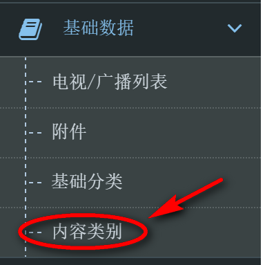
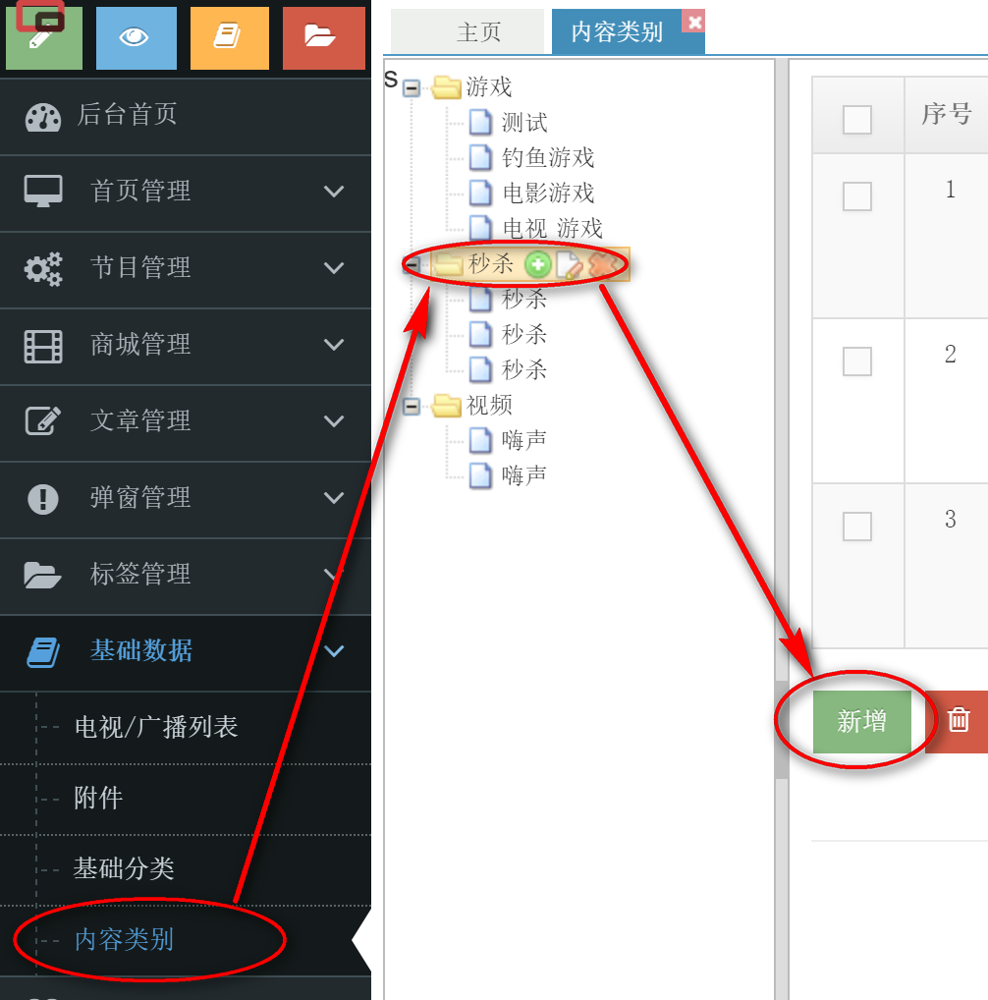
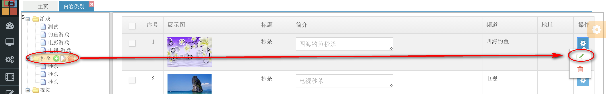
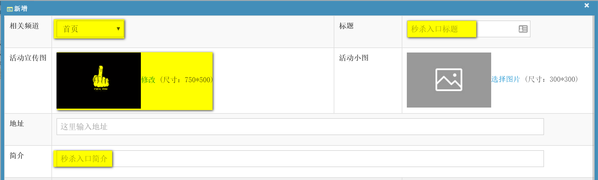
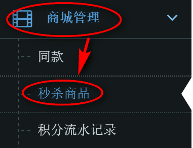
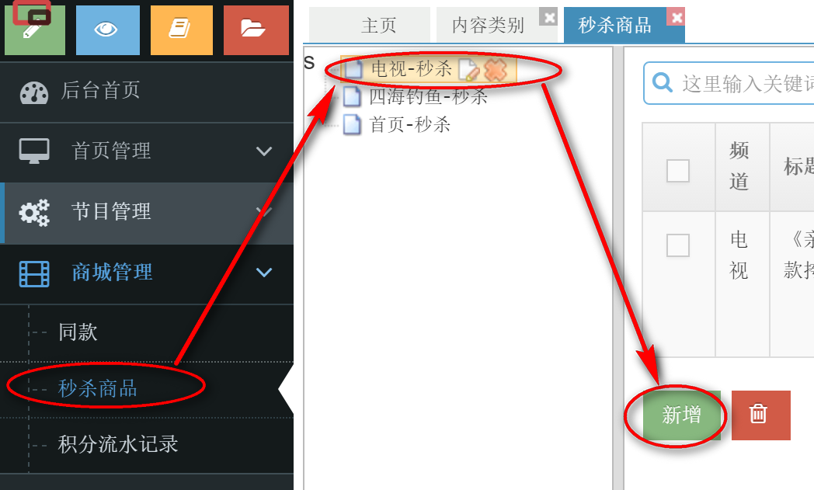
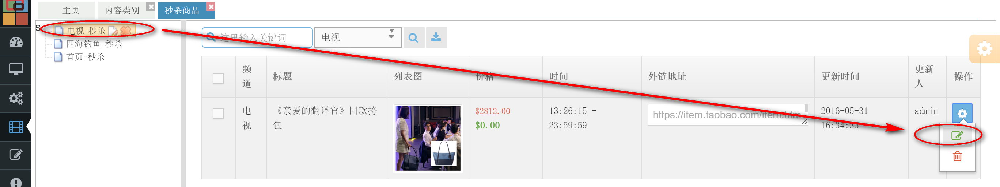
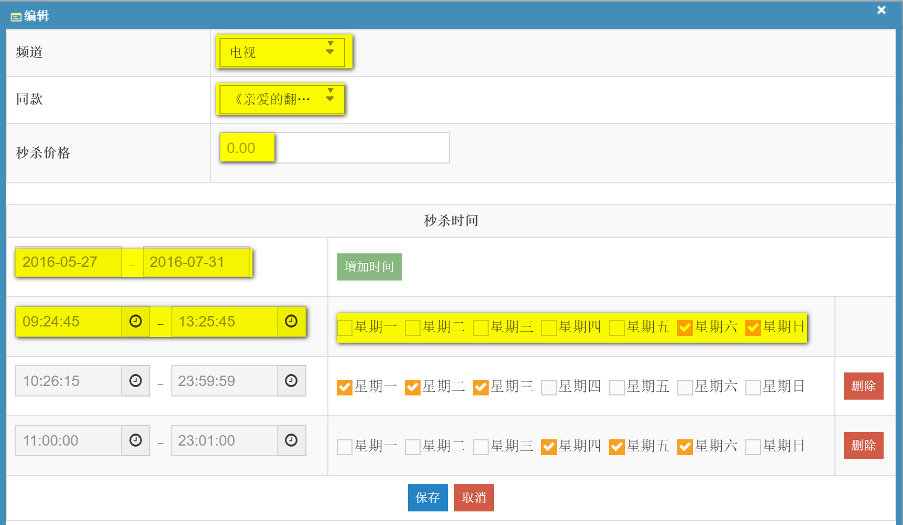

# 首页及各分类页面`秒杀入口`、`秒杀商品`维护

### 秒杀入口维护

1. 登录后台，进入`基础数据` >`内容类别` 
   
2. 进入`秒杀类别`，点击`新增`或`编辑`已有秒杀
   
   
3. 打开新增弹出层，填写秒杀入口相关信息
   - 选择入口所在的`相关频道`
   - 填写秒杀`标题`
   - 上传入口显示的`活动宣传图`
   - 填写秒杀的`简介`
     
4. `保存`秒杀信息

### 秒杀商品维护
1. 切换到`商城管理`>`秒杀商品`
   
2. 进入对应栏目下的秒杀，点击`新增`或`编辑`已有的秒杀商品
   
   
   > 左侧列表树显示的是秒杀入口，显示形式为“频道-入口标题”
3. 打开新增弹出层，填写秒杀商品相关信息
   - 选择秒杀商品所在的`频道`
   - 选择要被秒杀`同款`
   - 填写秒杀活动的`秒杀价格`
   - 选择该商品参与秒杀的`日期范围`
   - 选择该商品参与秒杀的`时间段`和`该时间段出现的周期`
     