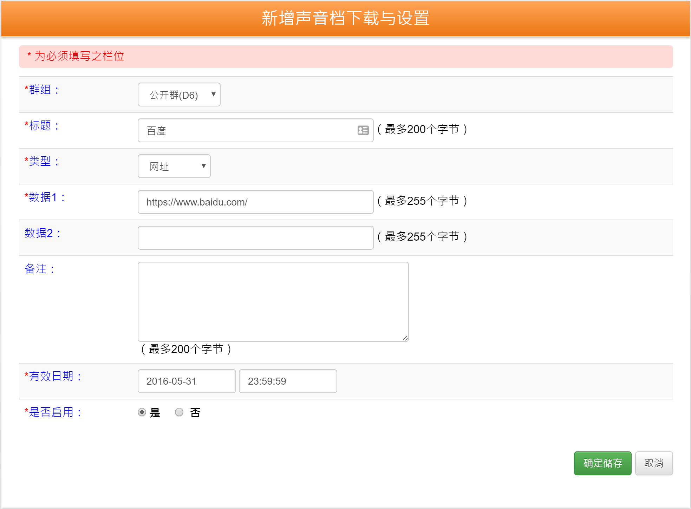

# 声波制作

1. 登录[声波管理平台](http://www.swipy.com.cn/swipygo/admin/main.php) *(账号：`sengseng`，密码：`seng123abc`)*，进入“ [声音档下载与设置](http://www.swipy.com.cn/swipygo/admin/soundList/list.php) ”
2. 点击`新增资料`，填写声波资料
3. 点击声音`下载`按钮，下载对应的声波音频文件
