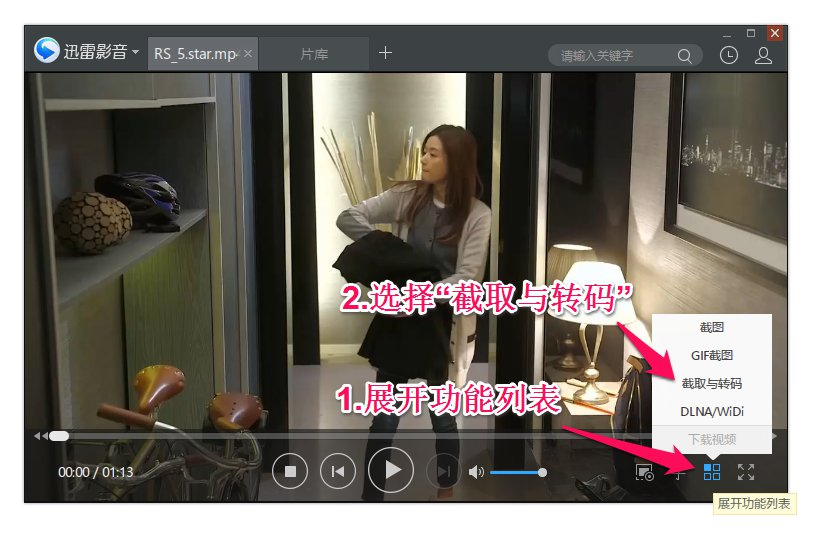
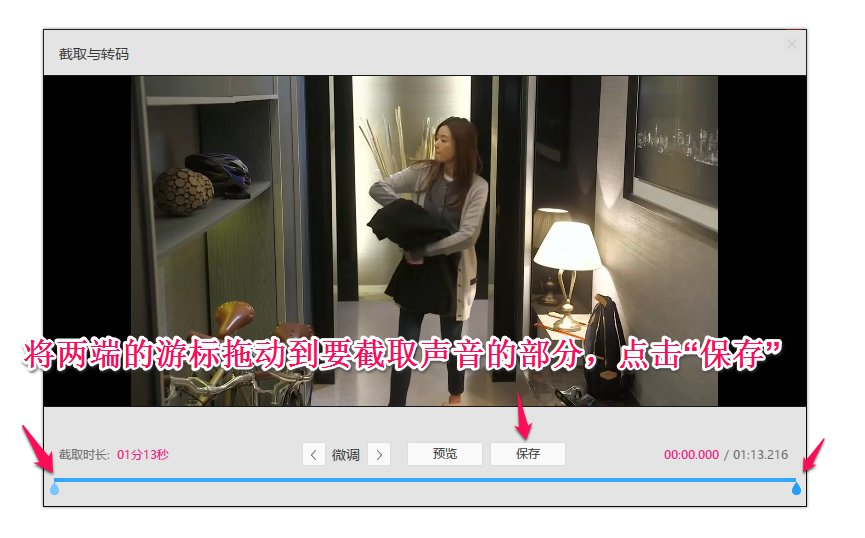
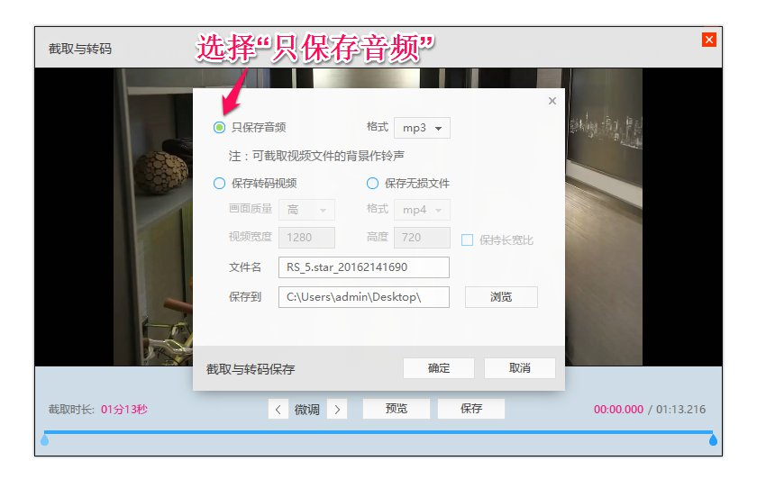
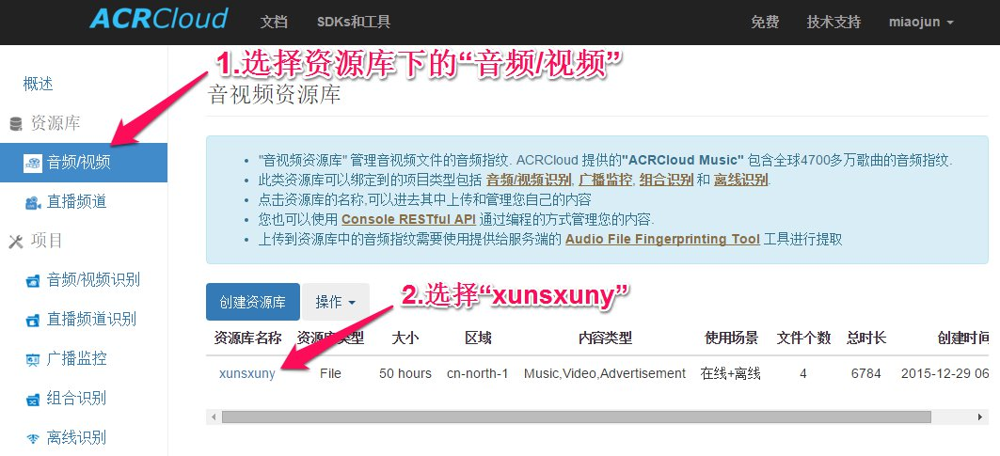
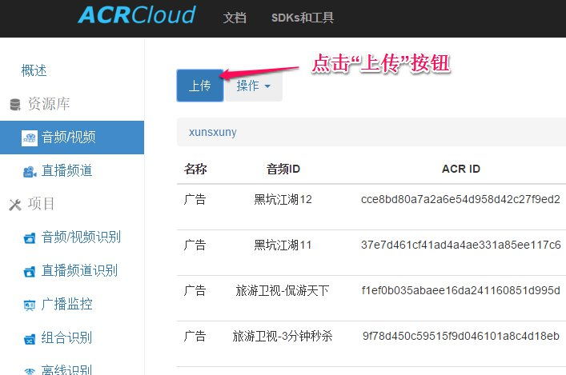
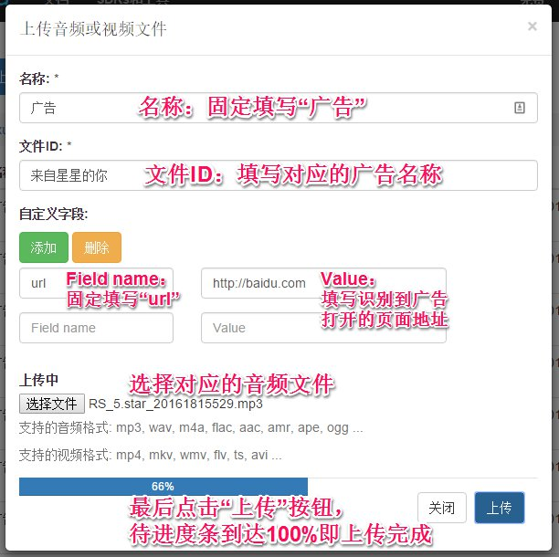

# 声纹上传
### 音频截取与转码

> 可以做截取与转码的工具很多（功能强大的Adobe Premiere、 Adobe Audition，专注格式转换的格式工厂，播放器QQ影音、迅雷影音...），这里我以`迅雷影音`为例作说明

1. **第一步**：用迅雷影音播放器打开视频，打开播放器中的转码工具
   
2. **第二步**：设置音频截取的位置
   
3. **第三步**：将截取的片段转码提取为音频
   

### 嗨声音频库上传音频
> 国内服务器地址：[http://console.acrcloud.cn/](http://console.acrcloud.cn/)
> 	账号：miaojun@xunsxuny.com
> 	密码：87654321

1. 进入资源库
   
2. 上传音频文件
   
   